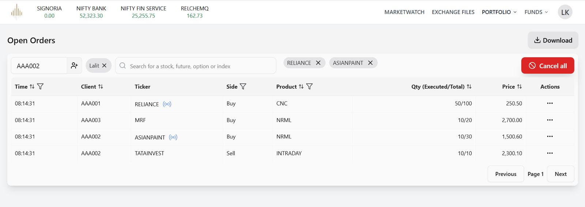
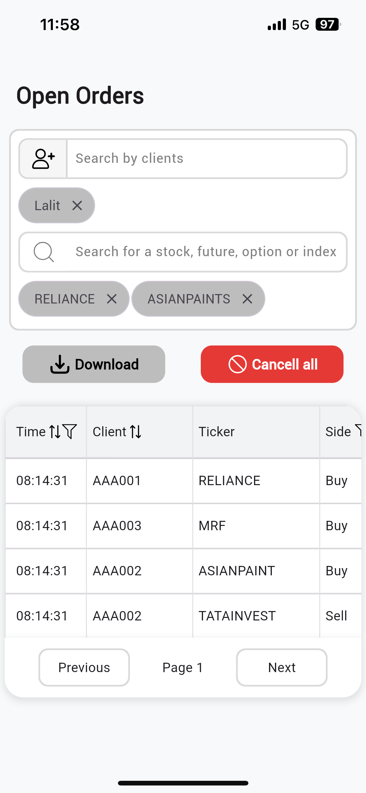
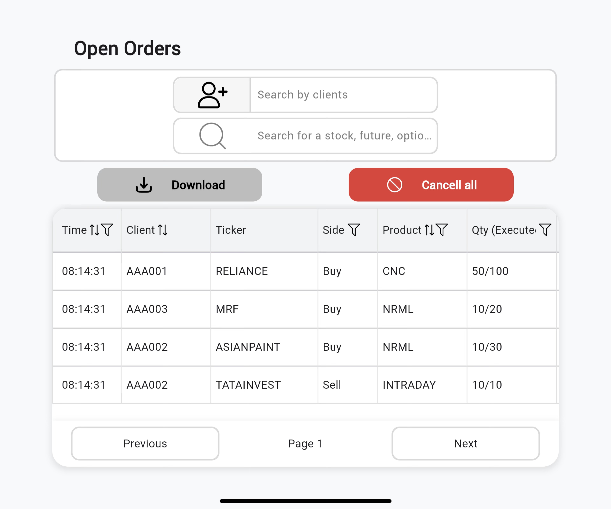

### 📄 Final `README.md`

```markdown
# Flutter Orders Page - Mobile Responsive UI

This project is part of the internship assignment for recreating the **Orders page** from the given web application into a **mobile-responsive Flutter UI**.  
The focus is on **UI/UX quality, responsiveness, and clean project structure**.

---

## 📌 Assignment Details
- Recreate the `Orders` page for **mobile devices** using **Flutter**.  
- Ensure the page is **responsive** across different screen sizes.  
- Follow best practices for **UI/UX**.  
- Submit the project as a **public GitHub repository** with a detailed README.  

---

## 🛠️ Tech Stack
- **Flutter** (latest stable version)  
- **Dart**  
- **Material Design** + custom widgets  

---

## 📂 Project Structure

```
<h2>📂 Project Structure</h2>

<pre>
lib/
 ┣ widgets/
 ┃ ┣ button.dart
 ┃ ┣ custom_border.dart
 ┃ ┣ custom_searchbar.dart
 ┃ ┣ filter_chips.dart
 ┃ ┣ order_table.dart
 ┣ main.dart
 ┣ order_screen.dart
assets/
 ┣ fonts/
 ┗ images/
</pre>

````

---

## 🚀 Getting Started

### 1️⃣ Clone the Repository
```bash
git clone https://github.com/shanu33/order_page_task.git
cd flutter_orders_responsive
````

### 2️⃣ Install Dependencies

```bash
flutter pub get
```

### 3️⃣ Run the App

```bash
flutter run
```

---

## 📱 Screenshots

| Web Reference                                             | Mobile (Portrait)                                       | Mobile (Landscape)                                         |
| --------------------------------------------------------- | ------------------------------------------------------- | ---------------------------------------------------------- |
|  |  |  |

---

## 🎬 Video / GIFs

| Mobile (Portrait)                                           | Mobile (Landscape)                                              |
| ----------------------------------------------------------- |-----------------------------------------------------------------|
|  |  |

---

## 💡 Approach

1. Studied the provided **Orders page screenshot** and referred to other **fintech & stock market applications** to get UI inspiration.
2. Broke down the UI into **modular, reusable widgets**, such as:
   - `button.dart`
   - `custom_searchbar.dart`
   - `filter_chips.dart`
   - `order_table.dart`
3. Implemented **responsive design** using:
   - `MediaQuery` for screen dimensions and relative layout building (so that elements adapt proportionally across devices).
   - `LayoutBuilder` for adaptive layouts.
   - `AdaptiveLinearLayout` for flexible responsiveness.
4. Ensured a **clean project structure** for scalability.
5. Focused on **mobile-first design** with smooth UX.

---

## 📌 Notes

* The UI is primarily optimized for **mobile screens**.
* Can be extended for **tablet and desktop layouts** if needed.

---

## 👨‍💻 Author

* **Shahnawaz Khan**
* [GitHub Profile](https://github.com/shanu33)
